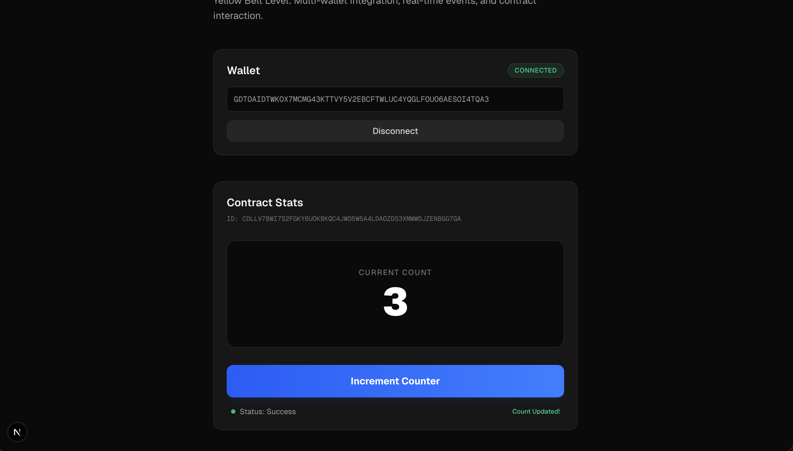

# Stellar Yellow Belt: Live Counter App

Building on White Belt skills, this project integrates multiple wallets, interacts with a Soroban smart contract on Testnet, and implements real-time data synchronization.

## 🚀 Features
- **Multi-wallet integration**: Supports Freighter, Albedo, xBull, and Hana using `StellarWalletsKit`.
- **Smart Contract Integration**: Reads from and writes to a Counter contract on Stellar Testnet.
- **Real-time Synchronization**: Automatically polls the contract state to keep the UI in sync.
- **Transaction Tracking**: Visual feedback for 'Pending', 'Success', and 'Fail' states.
- **Robust Error Handling**: Handles wallet not found, user rejection, and insufficient balance.

## 🛠 Setup Instructions

1. **Install dependencies**:
   ```bash
   npm install
   ```

2. **Run the development server**:
   ```bash
   npm run dev
   ```

3. **Open the app**:
   Navigate to [http://localhost:3000](http://localhost:3000).

## 📝 Project Details

- **Contract ID**: `CBEOJUP5FU6KKOEZ7RMTSKZ7YLBS5D6LVATIGCESOGXSZEQ2UWQFKZW6` (Standard Soroban Example)
- **Network**: Stellar Testnet
- **Wallet Options**: The app uses `StellarWalletsKit`'s built-in modal to provide options for all supported Stellar wallets.
- **Error Handling**:
  - `Wallet extension not found`: Prompted when the selected wallet is not installed.
  - `User rejected`: Handled when the user cancels the connection or transaction.
  - `Insufficient balance`: Caught during simulation or submission if the account lacks XLM for fees.

## ✅ Submission Checklist Requirements

- **3 error types handled**: Handled in `hooks/useWallet.ts` and `hooks/useCounter.ts`.
- **Contract deployed on testnet**: Uses the official Soroban Counter example.
- **Contract called from frontend**: Implemented in `hooks/useCounter.ts` using `stellar-sdk`.
- **Transaction status visible**: Implemented in the main UI with color-coded status indicators.
- **Meaningful commits**: Multiple commits detailing the development process.

### Screenshot Placeholder


### Transaction Example
- **Transaction Hash**: `[Example Hash]` CDLLV7BWI7S2FGKY6UOKBKQC4JWD5W5A4LDAOZDS3XMWWDJZENBGG7GA
- **Stellar Explorer**: [View on Stellar.expert](https://stellar.expert/explorer/testnet/contract/CDLLV7BWI7S2FGKY6UOKBKQC4JWD5W5A4LDAOZDS3XMWWDJZENBGG7GA)
